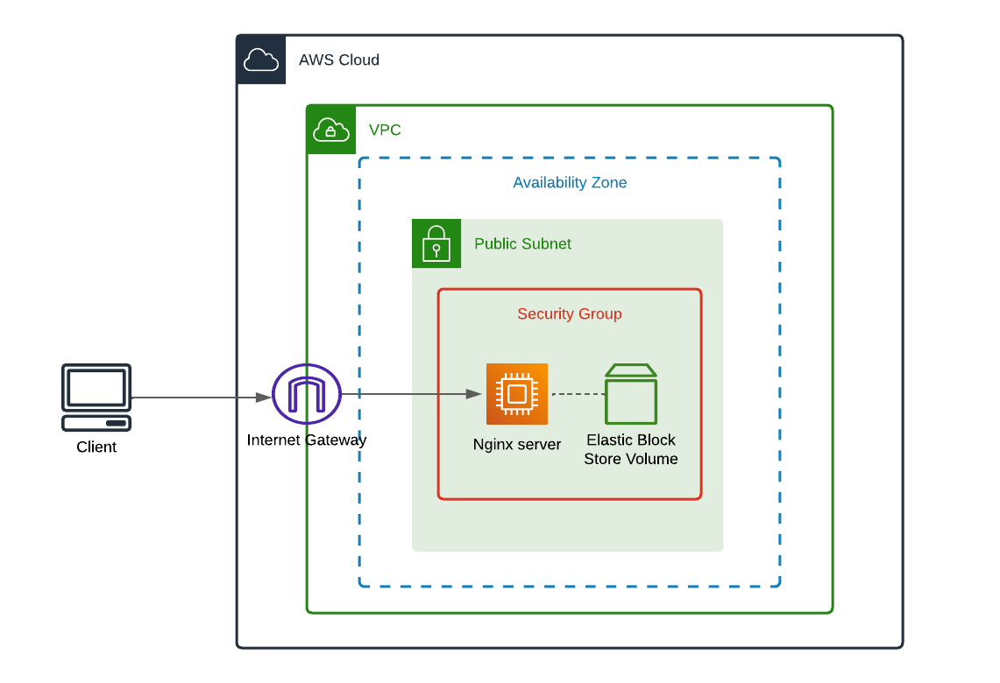

# **Simple Module to create an EC2 instance with Nginx**

This module creates an EC2 instance with the needed configuration to have a nginx server up and running.

### **THIS IS A DEV MODULE DO NOT USE IT IN PRODUCTION**

---

## Architecture



### Example of use

1. Set your **local variables**

```hcl
locals {
  vpc_name          = "<VPC-NAME>"
  vpc_cidr          = "<VPC-CIDR>"
  vpc_az            = "<VPC-AVAILABILITY-ZONE>"
  vpc_public_subnet = "<CIDR-FOR-THE-PUBLIC-SUBNET>"
  local_machine_ip  = "<YOUR-PUBLIC-IP-TO-SSH>"
  ssh_key           = "ssh-rsa <PUBLIC-RSA-KEY> user@host"
  instance_type     = "<INSTANCE-TYPE>"
  server_name       = "<ServerName>"
}
```

2. Use the [simple example](example/main.tf)

```hcl
module "network" {
  source            = "<PATH-TO-THE-MODULE>"
  vpc_name          = "<VPC-NAME>"
  vpc_cidr          = "<VPC-CIDR>"
  vpc_az            = "<VPC-AVAILABILITY-ZONE>"
  vpc_public_subnet = "<CIDR-FOR-THE-PUBLIC-SUBNET>"
  local_machine_ip  = "<YOUR-PUBLIC-IP-TO-SSH>"
}
```

---

Remember this is a dev module, **_Do not use it in production_**
